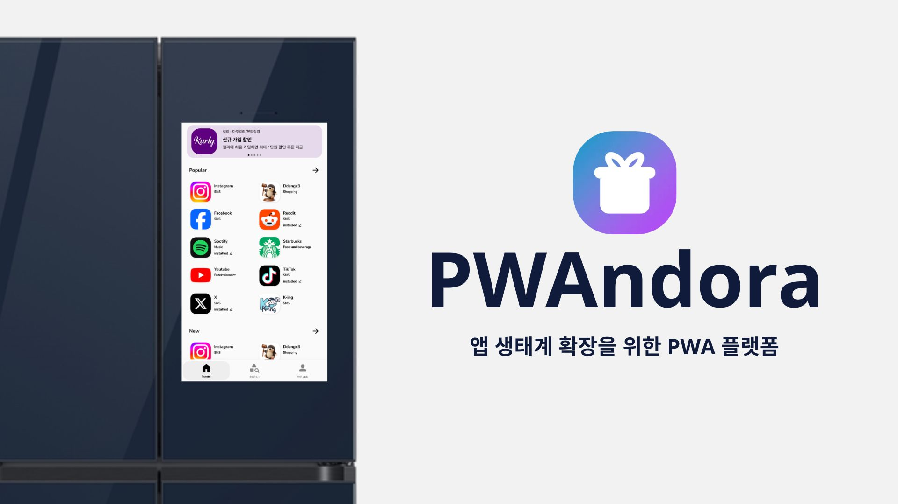
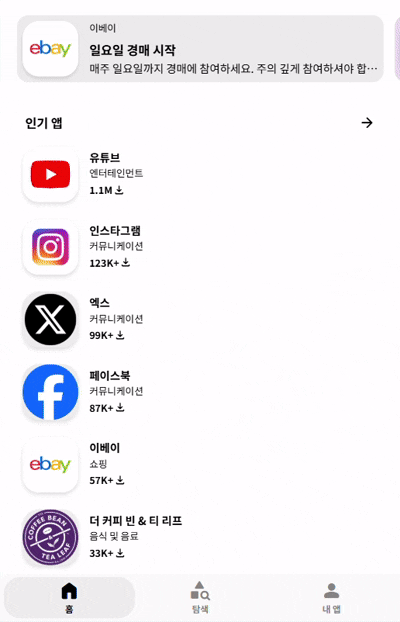
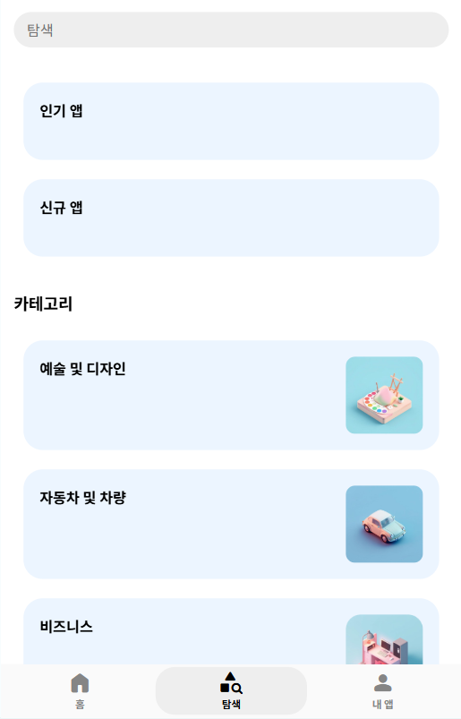
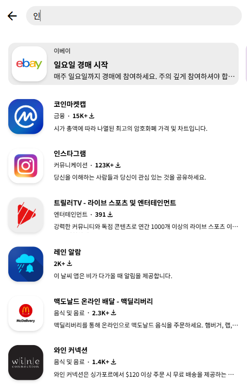
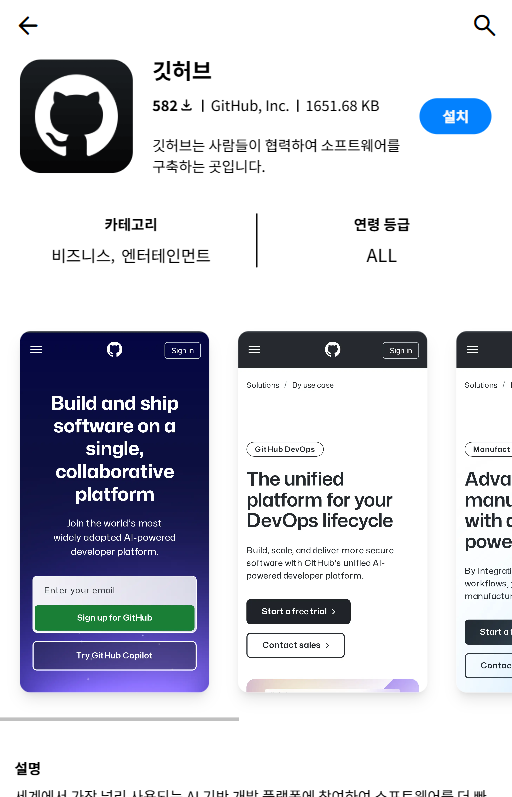
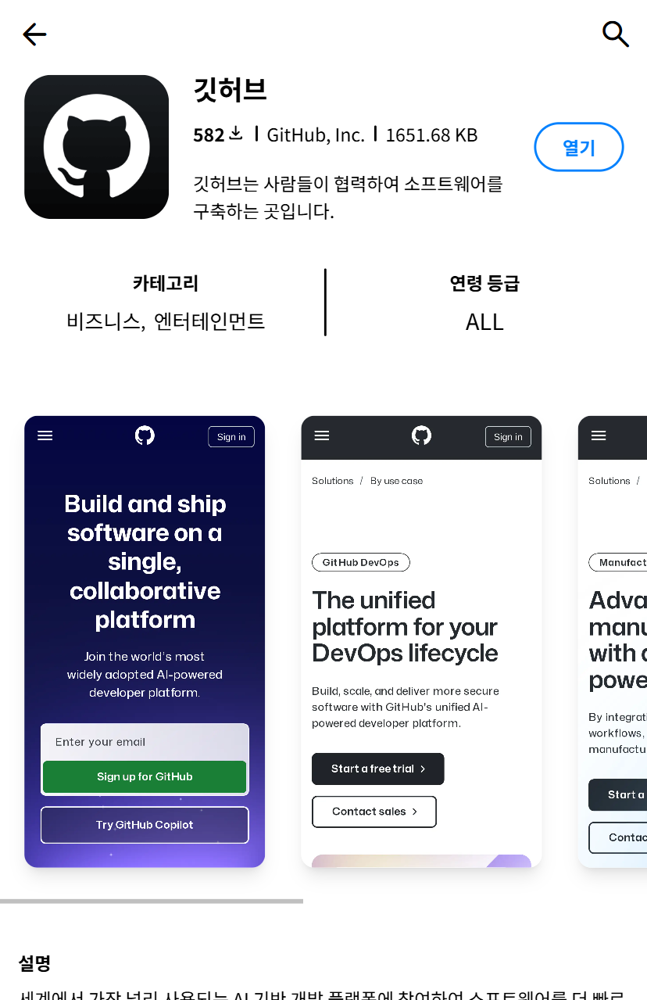
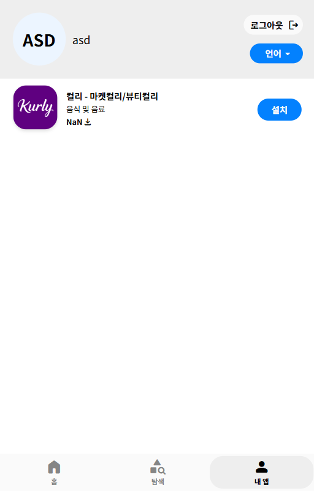
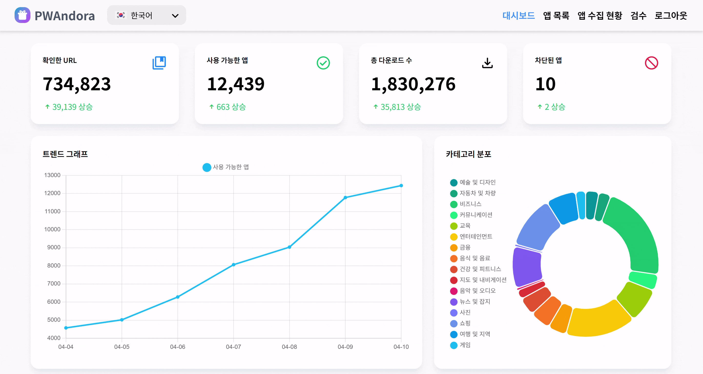
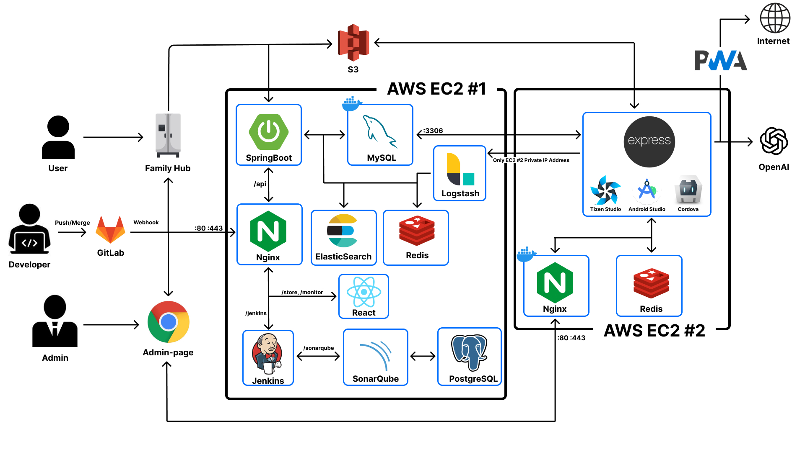
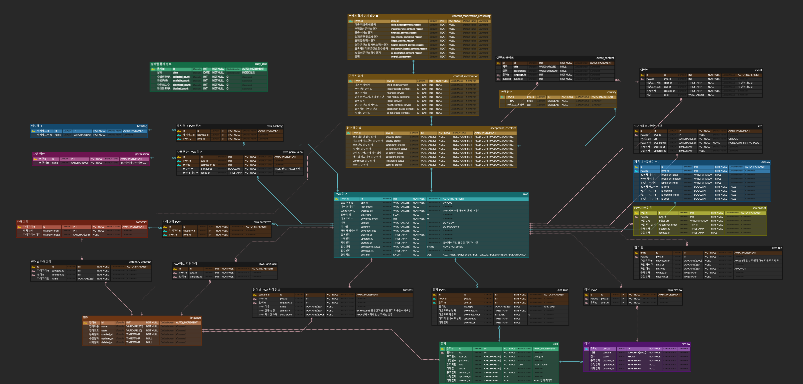

<h1 align="center">📱 PWAndora</h1>

삼성전자 DA 사업부 연계 프로젝트 (1위)

  

  

## 📌 목차

1. [개요](#1-프로젝트-개요)
2. [기능 소개](#2-기능-소개)
3. [기술 스택](#3-기술-스택)
4. [아키텍처](#4-아키텍처-및-erd)

##  1. 프로젝트 개요

| 항목 | 내용 |
| --- | --- |
| <b>프로젝트명</b> | `PWAndora` |
| <b>기간</b> | 2025.02.24 ~ 2025.04.11 (7주) |  

### 프로젝트 소개
최근 스크린이 탑재된 스마트 가전의 보급이 확대되면서, 가전 내에서 활용할 수 있는 애플리케이션의 수요도 증가하고 있습니다.

그러나 현재 구글 플레이스토어에는 약 168만 개 이상의 앱이 등록되어 있는 반면, 삼성 패밀리허브 냉장고에는 음식, 엔터테인먼트, 가족, 스마트홈 등의 카테고리에 걸쳐 단 31개의 기본 앱만이 제공되고 있어, 사용자의 다양한 니즈를 충족하기에는 한계가 있습니다.

기존의 앱 확보 방식은 개별 콘텐츠 공급자와의 제휴 또는 개발을 기반으로 하기 때문에, 다양한 앱을 빠르게 확보하고 배포하는 데에는 한계가 존재합니다.
이에 따라 우리는 별도의 설치 없이 다양한 플랫폼에서 실행 가능한 PWA(Progressive Web App)를 수집 및 제공함으로써, 스마트 가전의 앱 생태계를 보다 효율적으로 확장하고자 합니다.

본 프로젝트는 안드로이드 및 타이젠 OS 기반의 공용 스토어로서, 반응형 UI와 자동 앱 수집 및 검수 기능을 제공하여 확장성과 유지보수의 효율을 함께 고려하였습니다.

## 2. 기능 소개
### 앱 스토어 - 앱 목록 조회
1. 상단에 자동 생성된 광고 배너가 있고, 인기, 신규, 카테고리별 앱을 볼 수 있습니다.
2. 카테고리별 조회가 가능합니다.
3. 앱 이름으로 검색할 수 있습니다.

  
  
  

### 앱 스토어 - 상세페이지 및 유저페이지
1. 앱의 이름, 크기, 스크린샷 등 정보를 포함한 상세 화면. 설치 버튼 클릭시 앱이 다운로드 됩니다.
2. 이미 설치된 앱은 열기 버튼으로 바뀌며, 클릭시 앱으로 연결됩니다.
3. 유저 정보와 설치 기록이 있는 앱을 조회할 수 있습니다.

  
  
  

### 관리자 - 대시보드
- 확인한 사이트, 수집한 앱 개수, 다운로드 수 및 차단한 앱 개수가 실시간으로 업데이트됩니다. 
- 최근 일주일간의 앱 수집 현황과, 전체 앱의 카테고리 분포를 그래프로 확인할 수 있습니다.

  

### 관리자 - 앱 관리
1. 앱 목록에서 차단여부, 검수여부로 필터링 할 수 있습니다. 차단 버튼을 눌르면 앱이 차단됩니다.
2. 앱 상세 페이지에서 lighthouse 점수와 앱 상세 정보를 볼 수 있고, 수정 버튼을 누르면 정보 수정이 가능합니다. 스크린샷의 추가, 삭제, 순서변경을 할 수 있습니다.

  
  

### 관리자 - 앱 수집 현황
1. 앱 수집 현황을 확인하고, 기록 클릭시 상세 로그를 조회할 수 있습니다.
2. 현재 수집이 진행중이라면, 어떤 URL이 처리중인지, 어떤 단계에서 성공 또는 실패했는지 확인할 수 있습니다.

  
  

### 관리자 - 검수
1. AI가 1차로 검수해준 데이터를 기반으로 검수를 진행합니다. 
앱 정보, AI 생성 데이터, 스크린샷, 디스플레이 호환성, 콘텐츠 건전성, 패키징, 성능 점수, 보안까지 8가지 항묵 중 확인이 필요한 항목을 확인하고, 등록 또는 차단 버튼을 놀러 검수를 완료합니다.

  

## 3. 기술 스택

<table>
    <tr>
    <td><b>Front-end</b></td>
    <td>

 

    </td>
    </tr>
    <tr>
        <td><b>Back-end</b></td>
        <td>

 

 

</td>
    </tr>
    <tr>
    <td><b>Crawling & Packaging</b></td>
    <td>

   </td>
    </tr>
    <tr>
    <td><b>Infra</b></td>
    <td>

</td>
    <tr>
    <td><b>Tools</b></td>
    <td>
    
    
    

    </td>
    </tr>
</table>

## 4. 아키텍처 및 ERD

  

    
